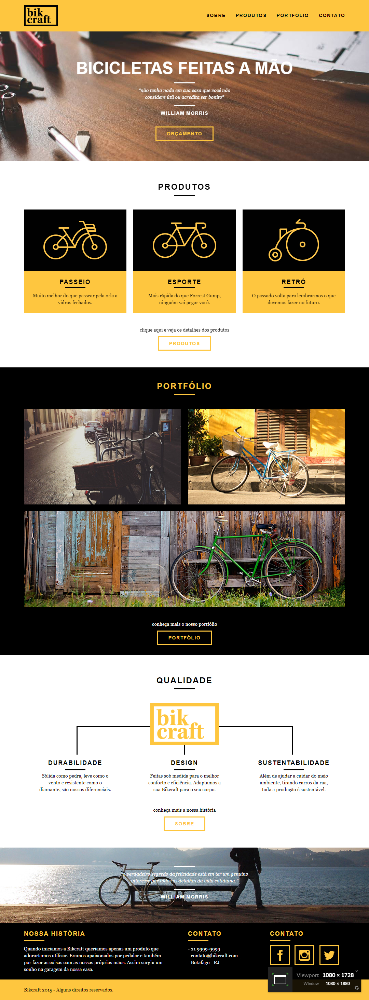

# Bikcraft

## Projeto prático Bikcraft feito através do curso de CSS com SASS da [Origamid](https://www.origamid.com/curso/css-com-sass)

## Link do Projeto: [Bikcraft](https://marcelo-rafael.github.io/sass-projeto-bikcraft/)

### Etapas para a criação do Projeto

- 01 - Le Scone
- 02 - Grid
- 03 - Media Queries
- 04 - Grid Function
- 05 - Row
- 06 - HTML
- 07 - Variáveis e Mixins
- 08 - Geral
- 09 - introdução
- 10 - Menu
- 11 - Contato
- 12 - Rodapé

